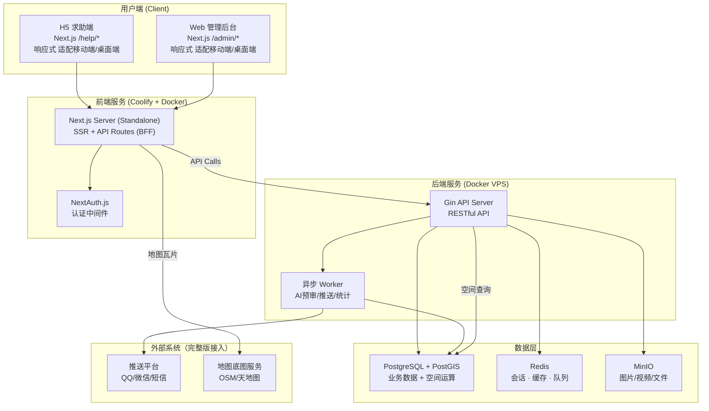
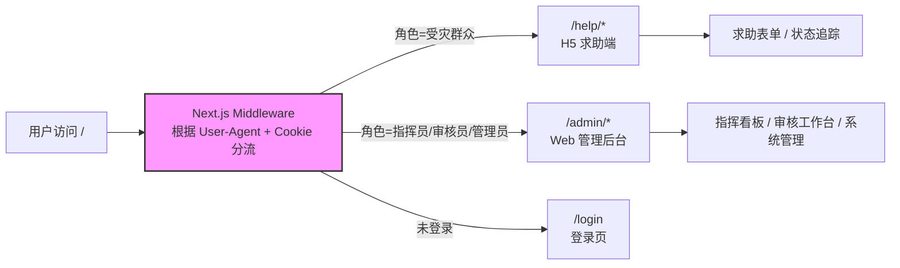
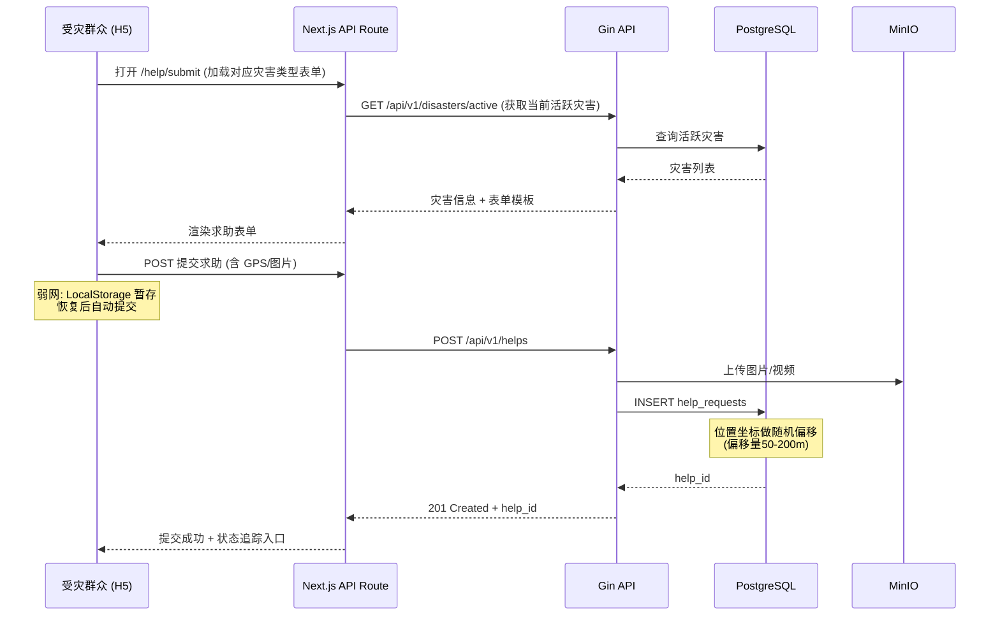
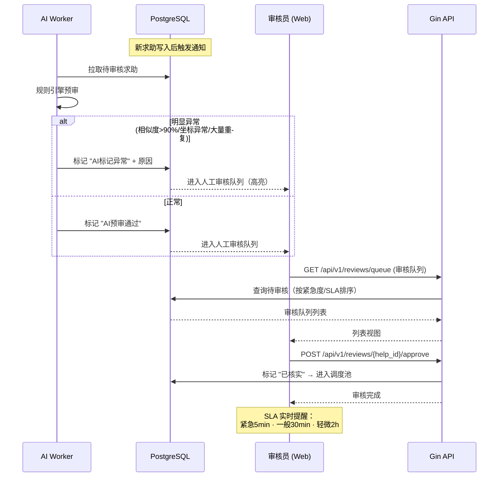
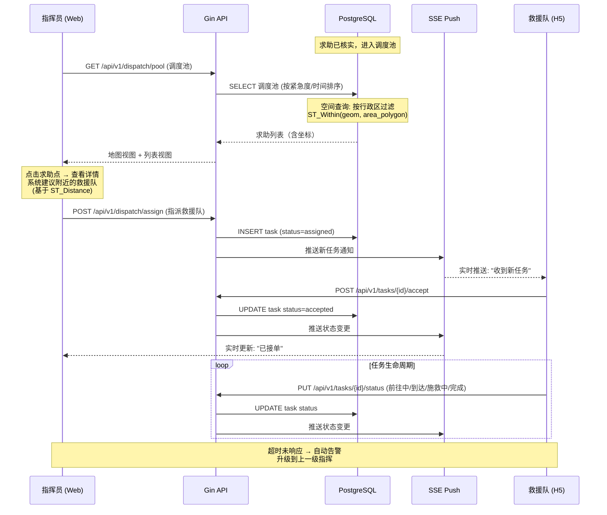
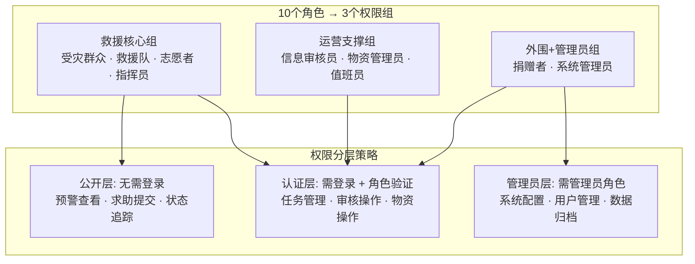
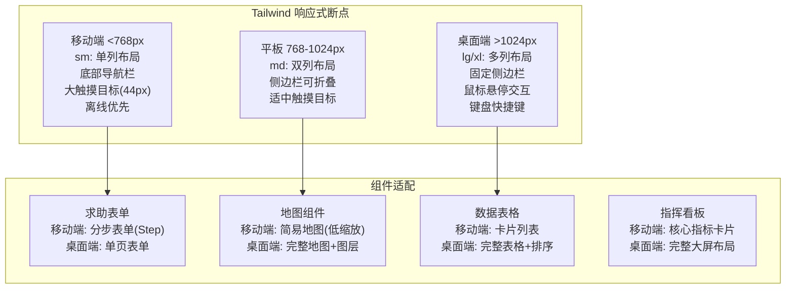
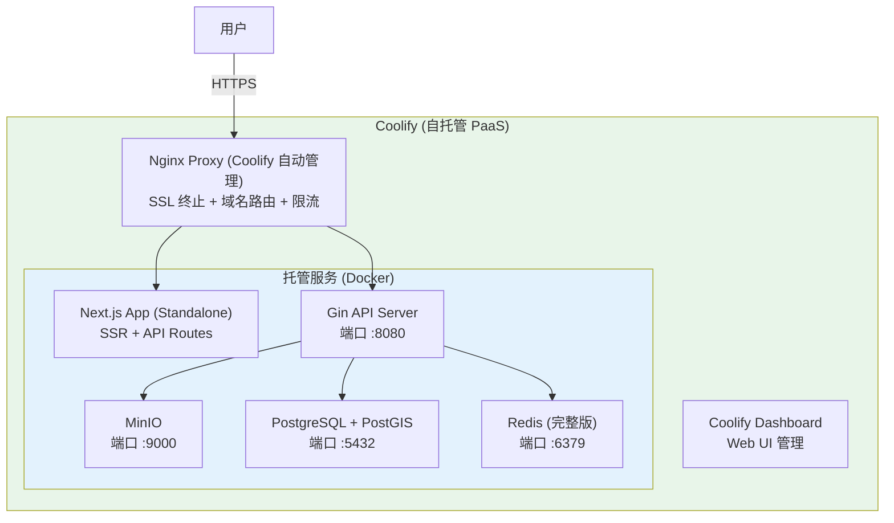
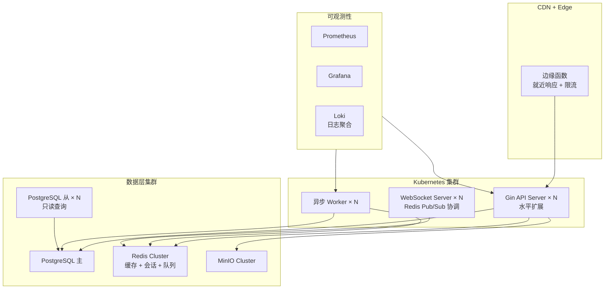
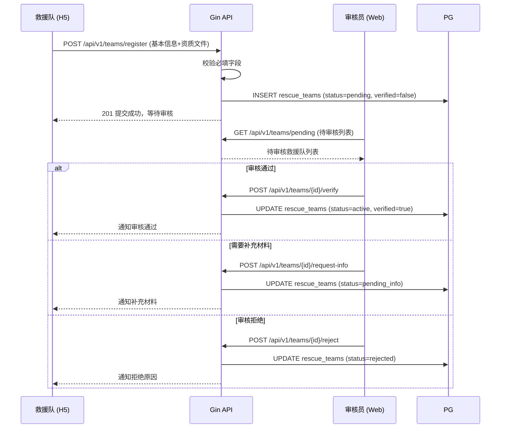

# REQ-001 技术方案：灾害应急调度系统

> **方案版本**: v1.2 · **创建日期**: 2026-07-14 · **评审日期**: 2026-07-14
>
> **决策速览**：后端 Go + Gin · 前端 React + Next.js · 数据库 PostgreSQL + Redis · 部署 Coolify (自托管) + Docker VPS

---

## 1. 技术选型

### 1.1 选型概览

| 层级 | 技术 | 作用简介 | 为什么选它 |
|------|------|---------|-----------|
| **后端框架** | Go + Gin | HTTP 服务框架——处理路由、中间件、请求响应 | Go 编译为单一二进制、部署最简单；Gin 是 Go 社区最活跃的 HTTP 框架，API 简洁，性能高 |
| **数据库** | PostgreSQL 16 + PostGIS | 关系型数据库——存储所有业务数据；PostGIS 扩展提供地理空间运算（地图、围栏、热力图） | 开源协议友好，PostGIS 是地理空间查询的行业标准，JSONB 支持灵活字段，一人一 DB 零成本 |
| **缓存** | Redis 7 | 内存缓存——实时任务状态、会话、排行榜、消息队列 | MVP 可只用 PG；完整版用 Redis 做热数据加速和轻量消息队列 |
| **前端框架** | React 18 + Next.js 14 (App Router) | Web 框架——一套代码同时覆盖管理后台和 H5 求助端 | App Router 按角色天然分路由；Next.js Middleware 做鉴权；Tailwind CSS 响应式适配移动端/桌面端零额外成本 |
| **UI 方案** | Tailwind CSS + shadcn/ui | 原子化 CSS 框架 + React 组件库 | Tailwind 响应式断点(sm/md/lg/xl)适配移动端；shadcn/ui 无依赖、源码可改、Tree-shaking 无冗余 |
| **地图** | MapLibre GL JS (前端) + PostGIS (后端) | 开源地图渲染引擎 + 空间数据库 | MapLibre 是 Mapbox GL JS 的开源分支，无商业授权费；PostGIS 提供 ST_Distance/ST_Within 等空间函数 |
| **实时通信** | SSE (MVP) → WebSocket (完整版) | 服务端推送技术——任务状态变更、指挥看板实时刷新 | MVP 用 SSE 实现单向推送（服务器→客户端），实现简单；完整版升级 WebSocket 支持双向通信 |
| **部署** | Coolify (自托管) + Docker Compose | 部署平台——Coolify 自托管 PaaS 管理所有服务（前端/后端/数据库），统一 Docker 化部署 | Coolify 开源自托管，自带 CI/CD、SSL、域名管理；单机 VPS 全托管，无厂商锁定 |
| **对象存储** | MinIO (MVP) → S3 兼容存储 | 文件存储——求助现场照片/视频/录音 | MinIO 开源、S3 兼容 API，单机部署即可；后续迁移到云 S3 或自建集群零代码改动 |
| **监控** | Prometheus + Grafana (完整版) | 指标采集 + 可视化——服务健康、QPS、延迟 | 开源标准方案，MVP 可暂不用（Docker 日志 + `docker stats` 足够） |
| **CI/CD** | GitHub Actions (MVP) | 自动化流水线——代码检查、测试、构建、部署 | GitHub 免费额度充裕，社区 Actions 生态丰富 |

### 1.2 MVP vs 完整版技术差异

```
MVP（阶段一，1-2人开发，2-4周上线）         完整版（阶段二/三，4-6人团队迭代）

┌─────────────────────────────────┐     ┌─────────────────────────────────┐
│ Go + Gin (单体服务)              │     │ Go + Gin (模块化单体 → 拆分微服务) │
│ PostgreSQL (单实例)              │     │ PostgreSQL (主从 + 连接池)        │
│ 无需 Redis (PG 内存表替代)       │     │ Redis (缓存/队列/实时状态)        │
│ SSE 推送                         │     │ WebSocket + Redis Pub/Sub         │
│ MinIO (本地磁盘)                  │     │ MinIO / S3 集群                   │
│ Docker Compose (单机部署)         │     │ Docker Compose → K8s              │
│ 无监控 (docker stats 够用)       │     │ Prometheus + Grafana              │
│ 手工部署 + Git Hook              │     │ GitHub Actions CI/CD              │
└─────────────────────────────────┘     └─────────────────────────────────┘
```

**MVP 的可扩展性保证**：
- 代码按 `service` 层拆分接口，后续只需改 `impl` 即可迁移到独立微服务
- 数据库表设计预留分区键（`disaster_id`），后续可水平分表
- SSE 接口改造为 WebSocket 只需新增 handler，不影响业务逻辑
- MinIO 使用 S3 兼容 API，迁移到云存储零代码改动

### 1.3 部署与运维：Coolify 自托管方案

**Coolify 是什么**：Coolify 是一个开源自托管 PaaS 平台（AGPL-3.0），提供类似 Vercel/Heroku 的体验但运行在自有服务器上。核心能力：

- **Docker 原生**：所有服务（前端/后端/数据库）通过 Docker 容器运行，Coolify 自动管理镜像构建和容器生命周期
- **内置 CI/CD**：支持 GitHub/GitLab 集成，Git Push 自动触发构建部署
- **自动 SSL**：内置 Let's Encrypt，自动签发和续期 SSL 证书
- **域名管理**：内置 Nginx Proxy，自动配置反向代理和路由
- **数据库管理**：内置 PostgreSQL/Redis/MySQL 一键创建和备份
- **PR 预览环境**：支持为每个 PR 自动创建预览部署
- **基础监控**：内置 CPU/内存/磁盘监控

**MVP 推荐部署方式 — 单机全包**：

```
┌─────────────────────────────────���────────┐
│            Coolify VPS (Hetzner CX22)     │
│                   $4/月                   │
│                                          │
│  ┌────────────────────────────────────┐  │
│  │        Coolify Dashboard            │  │
│  │   (Web UI 管理所有服务)             │  │
│  └────────────────────────────────────┘  │
│                                          │
│  ┌──────────┐ ┌──────────┐ ┌─────────┐  │
│  │ Next.js   │ │ Gin API  │ │ MinIO   │  │
│  │ (Docker)  │ │ (Docker) │ │(Docker) │  │
│  └──────────┘ └──────────┘ └─────────┘  │
│  ┌──────────┐ ┌──────────┐              │
│  │PostgreSQL│ │  Redis   │              │
│  │(Docker)  │ │ (Docker) │              │
│  └──────────┘ └──────────┘              │
│                                          │
│  Nginx Proxy (Coolify 自动管理)          │
│  ├─ SSL (Let's Encrypt)                 │
│  ├─ 域名路由                            │
│  └─ 反向代理                            │
└──────────────────────────────────────────┘
```

**两种部署选项**：

| 选项 | 配置 | 月费 | 适用 |
|------|------|------|------|
| **单机全包**（MVP 推荐） | Hetzner CX22 (2C4G) 一台，Coolify + 全部服务 | ~$4/mo | MVP 阶段，<1000 DAU |
| **分离部署** | Coolify VPS ($24/mo DO 4C8G) + DB VPS 独立 | ~$48/mo | 流量增长后，需要资源隔离 |

**Next.js SSR/ISR 在 Docker 下的支持**：
- 使用 Next.js **standalone 模式**构建（`output: 'standalone'` in next.config.js），生成自包含的 Node.js 服务
- ISR（Incremental Static Regeneration）：standalone 模式完全支持 ISR，缓存文件存储在容器内或挂载的 volume 中
- SSR：standalone 模式内置 Node.js 服务器处理 SSR 请求
- Edge 函数：Coolify 不支持 Vercel Edge Runtime，需将 Edge 逻辑移回 Node.js runtime（Middleware 在 standalone 模式以 Node.js 运行）。本项目不依赖 Edge 特有 API，无迁移成本

**CI/CD 流程**：
```
Git Push (main) → Coolify Webhook → Docker Build → 健康检查 → 滚动更新 → 旧容器下线
Git Push (PR)   → Coolify Webhook → Docker Build → PR 预览环境 → 合并后自动清理
```

---


## 2. 技术架构

### 2.1 系统架构全景



### 2.2 前端路由架构（按角色 + 平台分流）



### 2.3 后端服务模块划分

```
backend/
├── cmd/server/main.go          # 入口
├── internal/
│   ├── handler/                # HTTP Handler 层 (路由绑定)
│   │   ├── disaster.go         # 灾害实例 CRUD
│   │   ├── help.go             # 求助上报/查询/状态追踪
│   │   ├── review.go           # 审核工作台
│   │   ├── dispatch.go         # 救援调度
│   │   ├── task.go             # 任务状态管理
│   │   ├── team.go             # 救援队注册/管理
│   │   ├── supply.go           # 物资管理 (完整版)
│   │   ├── volunteer.go        # 志愿者 (完整版)
│   │   └── admin.go            # 系统管理
│   ├── service/                # 业务逻辑层 (每个 handler 对应一个 service)
│   ├── repository/             # 数据访问层 (PG/SQL)
│   ├── middleware/
│   │   ├── auth.go             # JWT 鉴权
│   │   ├── rbac.go             # 角色权限控制
│   │   ├── ratelimit.go        # 频率限制
│   │   └── logger.go           # 请求日志
│   ├── model/                  # 数据模型/结构体
│   ├── worker/                 # 后台 Worker
│   │   ├── ai_review.go        # AI 预审 (规则引擎)
│   │   └── stats.go            # 统计计算
│   └── config/                 # 配置管理
├── migrations/                 # 数据库迁移文件
└── docker-compose.yml
```

---

## 3. 核心模块设计

### 3.1 求助上报流程



**关键设计点**：
- 求助表单按灾害类型动态切换（地震→被困/受伤/倒塌，洪涝→被困/缺水/缺食）
- GPS 双源定位：优先 GPS API，降级为 IP 定位
- **弱网离线**：求助内容先存 `LocalStorage`，监听 `online` 事件自动提交
- **一键求救**：单按钮，自动采集所有可采集信息，直接提交（不需要填任何表单）
- 提交后返回 `help_id`，可分享链接实时追踪状态

### 3.2 信息审核流程



**AI 预审规则**（MVP 阶段为确定性规则引擎，非机器学习）：
1. 文本相似度 >90% → 标记疑似重复
2. GPS 坐标位于海洋/境外 → 标记异常坐标
3. 同一设备短期大量提交 → 标记刷量嫌疑
4. 含敏感词库关键词 → 标记待确认

### 3.3 救援调度流程



### 3.4 权限模型 (RBAC)



**权限实现方式**：
- Next.js Middleware 做路由级守卫（`/admin/*` 需登录）
- Gin 中间件做 API 级鉴权（JWT + 角色声明）
- 数据库级：`help_requests` 的 `phone` 字段根据请求者角色决定返回脱敏/完整值

### 3.5 数据隐私实现

**位置偏移策略**：

```go
// 求助坐标存储时做随机偏移
type LocationPrivacy struct {
    Precise  GeoPoint `json:"-" db:"precise_lat,precise_lng"` // 精确坐标，不入 API 响应
    Offset   GeoPoint `json:"location" db:"offset_lat,offset_lng"` // 偏移坐标，公开可见
    OffsetM  float64  `json:"-" db:"offset_meters"` // 偏移量（50-200m 随机）
}
```

**信息可见性矩阵**：

| 信息字段 | 受灾群众 | 救援队(已接单) | 救援队(未接单) | 指挥员 | 审核员 | 志愿者 | 捐赠者 |
|---------|---------|-------------|-------------|-------|-------|-------|-------|
| 求助标题/描述 | ✅ | ✅ | ✅ | ✅ | ✅ | ✅ | ❌ |
| GPS (偏移后) | ✅ | ✅ | ✅ | ✅ | ✅ | ✅ | ❌ |
| GPS (精确) | ❌ | ✅ | ❌ | ✅ | ✅ | ❌ | ❌ |
| 手机号 | ✅ (自己的) | ✅ | ❌ | ✅ | ✅ | ❌ | ❌ |
| 现场照片 | ✅ | ✅ | ❌ | ✅ | ✅ | ❌ | ❌ |
| 求助者姓名 | ✅ | ✅ | ❌ | ✅ | ✅ | ❌ | ❌ |

---

## 4. 数据模型设计

### 4.1 MVP 核心表

```sql
-- 灾害实例
CREATE TABLE disasters (
    id UUID PRIMARY KEY DEFAULT gen_random_uuid(),
    name VARCHAR(200) NOT NULL,           -- e.g. "2026年泸定6.8级地震"
    type VARCHAR(50) NOT NULL,            -- earthquake/flood/typhoon/epidemic/other
    level VARCHAR(20) NOT NULL DEFAULT 'general',  -- red/orange/yellow/blue/general
    area_geom GEOMETRY(POLYGON, 4326),   -- 影响区域（地理围栏）
    status VARCHAR(20) NOT NULL DEFAULT 'active',  -- active/archived/closed
    started_at TIMESTAMPTZ NOT NULL,
    ended_at TIMESTAMPTZ,
    created_by UUID NOT NULL,
    created_at TIMESTAMPTZ DEFAULT NOW(),
    updated_at TIMESTAMPTZ DEFAULT NOW()
);

-- 求助记录
CREATE TABLE help_requests (
    id UUID PRIMARY KEY DEFAULT gen_random_uuid(),
    disaster_id UUID NOT NULL REFERENCES disasters(id),
    submitter_id UUID,                    -- 关联用户（可空，支持未登录求助）
    category VARCHAR(50) NOT NULL,        -- trapped/injured/collapse/missing/water_shortage/food_shortage/transfer/custom
    urgency VARCHAR(20) NOT NULL DEFAULT 'normal', -- critical/normal/mild
    description TEXT NOT NULL,
    affected_count INT DEFAULT 1,         -- 受影响人数
    -- 位置（双坐标策略）
    precise_geom GEOMETRY(POINT, 4326),  -- 精确坐标（权限控制访问）
    offset_geom GEOMETRY(POINT, 4326),   -- 偏移坐标（公开可见）
    offset_meters FLOAT DEFAULT 0,        -- 实际偏移量
    -- 联系信息
    phone VARCHAR(20),                    -- 权限控制访问
    contact_name VARCHAR(100),
    -- 状态流转
    status VARCHAR(30) NOT NULL DEFAULT 'pending_review',
    -- pending_review → reviewed → in_pool → assigned → accepted → en_route → rescuing → completed
    --                                                      → unable → need_backup
    review_status VARCHAR(20) DEFAULT 'pending',  -- pending/ai_flagged/approved/rejected/merged
    review_notes TEXT,
    reviewed_by UUID,
    reviewed_at TIMESTAMPTZ,
    -- 信用相关
    is_isolated_report BOOLEAN DEFAULT FALSE,  -- 孤立上报
    submitter_credit_score FLOAT,              -- 提交者信用分
    -- 归档
    is_archived BOOLEAN DEFAULT FALSE,
    created_at TIMESTAMPTZ DEFAULT NOW(),
    updated_at TIMESTAMPTZ DEFAULT NOW()
);

-- 救援队
CREATE TABLE rescue_teams (
    id UUID PRIMARY KEY DEFAULT gen_random_uuid(),
    name VARCHAR(200) NOT NULL,
    type VARCHAR(30) NOT NULL DEFAULT 'civil', -- registered/civil (注册救援队/民间救援力量)
    capabilities TEXT[] NOT NULL DEFAULT '{}',  -- {water,mountain,medical,rescue,fire}
    service_areas GEOMETRY(MULTIPOLYGON, 4326), -- 服务区域
    contact_phone VARCHAR(20) NOT NULL,
    contact_person VARCHAR(100),
    member_count INT DEFAULT 0,
    status VARCHAR(20) DEFAULT 'active',        -- active/inactive/suspended
    current_location GEOMETRY(POINT, 4326),    -- 当前位置（用于就近匹配）
    verified BOOLEAN DEFAULT FALSE,             -- 是否通过认证
    created_at TIMESTAMPTZ DEFAULT NOW()
);

-- 救援任务
CREATE TABLE rescue_tasks (
    id UUID PRIMARY KEY DEFAULT gen_random_uuid(),
    help_request_id UUID NOT NULL REFERENCES help_requests(id),
    team_id UUID NOT NULL REFERENCES rescue_teams(id),
    disaster_id UUID NOT NULL REFERENCES disasters(id),
    status VARCHAR(30) NOT NULL DEFAULT 'assigned',
    -- assigned → accepted → en_route → arrived → rescuing → completed
    --                                                   → unable → need_backup
    status_history JSONB DEFAULT '[]',     -- [{status, timestamp, operator_id}]
    assigned_by UUID NOT NULL,             -- 指挥员
    accepted_at TIMESTAMPTZ,
    completed_at TIMESTAMPTZ,
    notes TEXT,
    created_at TIMESTAMPTZ DEFAULT NOW(),
    updated_at TIMESTAMPTZ DEFAULT NOW()
);

-- 用户（简化 RBAC）
CREATE TABLE users (
    id UUID PRIMARY KEY DEFAULT gen_random_uuid(),
    username VARCHAR(100) UNIQUE NOT NULL,
    password_hash VARCHAR(255) NOT NULL,    -- bcrypt
    display_name VARCHAR(200),
    phone VARCHAR(20),
    role VARCHAR(30) NOT NULL DEFAULT 'victim',
    -- victim/rescue_team/volunteer/commander/zone_commander/
    -- reviewer/supply_manager/duty_officer/donor/admin
    team_id UUID REFERENCES rescue_teams(id), -- 救援队成员关联
    credit_score FLOAT DEFAULT 100.0,         -- 信用分（初始100）
    status VARCHAR(20) DEFAULT 'active',
    created_at TIMESTAMPTZ DEFAULT NOW()
);

-- 求助附件
CREATE TABLE help_attachments (
    id UUID PRIMARY KEY DEFAULT gen_random_uuid(),
    help_request_id UUID NOT NULL REFERENCES help_requests(id),
    type VARCHAR(20) NOT NULL,              -- image/video/audio
    url VARCHAR(500) NOT NULL,              -- MinIO 对象 URL
    thumbnail_url VARCHAR(500),             -- 缩略图
    file_size BIGINT,
    created_at TIMESTAMPTZ DEFAULT NOW()
);

-- AI 审核记录
CREATE TABLE review_ai_flags (
    id UUID PRIMARY KEY DEFAULT gen_random_uuid(),
    help_request_id UUID NOT NULL REFERENCES help_requests(id),
    flag_type VARCHAR(50) NOT NULL,         -- duplicate/abnormal_coords/spam/sensitive
    confidence FLOAT NOT NULL,              -- 置信度 0-1
    detail TEXT,                            -- 详细描述（如"与 help_request_id=xxx 相似度 95%"）
    created_at TIMESTAMPTZ DEFAULT NOW()
);

-- 空间索引
CREATE INDEX idx_help_requests_geom ON help_requests USING GIST(offset_geom);
CREATE INDEX idx_disasters_geom ON disasters USING GIST(area_geom);
CREATE INDEX idx_rescue_teams_geom ON rescue_teams USING GIST(current_location);
CREATE INDEX idx_help_requests_status ON help_requests(status, disaster_id);
CREATE INDEX idx_rescue_tasks_status ON rescue_tasks(status, disaster_id);
```

### 4.2 完整版扩展表（阶段二/三）

```
MVP 只需上述 7 张表（disasters / help_requests / rescue_teams / rescue_tasks / users / help_attachments / review_ai_flags）

完整版新增：
├── supplies          # 物资
├── warehouses        # 仓库
├── supply_orders     # 调拨单
├── donations         # 捐赠记录
├── volunteers        # 志愿者（独立于 users 的扩展信息）
├── task_volunteers   # 志愿者任务认领
├── plans             # 预案模板
├── plan_steps        # 预案步骤
├── knowledge_articles # 科普知识库
├── alerts            # 告警记录
└── audit_logs        # 审计日志
```

---

## 5. API 设计（核心接口）

### 5.1 接口总览

| 模块 | 数量 | 关键接口 |
|------|------|---------|
| 灾害管理 | 4 | `GET/POST /disasters`, `PUT /disasters/:id/close` |
| 求助上报 | 3 | `POST /helps`, `GET /helps/:id/status`, `GET /helps/mine` |
| 信息审核 | 3 | `GET /reviews/queue`, `POST /reviews/:id/approve`, `POST /reviews/:id/reject` |
| 救援调度 | 4 | `GET /dispatch/pool`, `POST /dispatch/assign`, `POST /dispatch/batch-assign` |
| 任务管理 | 3 | `PUT /tasks/:id/status`, `GET /tasks/mine`, `POST /tasks/:id/reject` |
| 救援队 | 4 | `POST /teams/register`, `GET /teams`, `GET /teams/nearby` |
| 认证 | 3 | `POST /auth/login`, `POST /auth/register`, `GET /auth/me` |
| 文件 | 2 | `POST /files/upload`, `GET /files/:id` |

### 5.2 关键接口示例

```
POST /api/v1/helps
Content-Type: multipart/form-data

Form Fields:
  disaster_id: UUID (required)
  category: "trapped" | "injured" | "collapse" | "missing" | ... (required)
  urgency: "critical" | "normal" | "mild" (default: normal)
  description: string (required, max 500 chars)
  affected_count: int (default: 1)
  latitude: float (required, 自动采集)
  longitude: float (required, 自动采集)
  contact_name: string (optional)
  phone: string (optional)
  attachments: file[] (optional, max 5 files, each <10MB)

Response 201:
{
  "help_id": "uuid",
  "status": "pending_review",
  "tracking_url": "/help/uuid/status",
  "estimated_review_time": "5分钟内"
}
```

```
GET /api/v1/dispatch/pool?disaster_id=xxx&zone=xxx

Response 200:
{
  "total": 156,
  "critical_count": 23,
  "normal_count": 120,
  "mild_count": 13,
  "items": [
    {
      "help_id": "uuid",
      "category": "trapped",
      "urgency": "critical",
      "location": {"lat": 30.123, "lng": 102.456},  // 偏移坐标
      "affected_count": 5,
      "waiting_minutes": 3,
      "nearby_teams": [  // 就近救援队建议
        {"team_id": "uuid", "name": "蓝天救援队", "distance_m": 2500, "available": true}
      ]
    }
  ]
}
```

---

## 6. 响应式设计策略（Web + H5 适配）



**关键适配原则**：
- 所有页面使用 `max-w-7xl mx-auto px-4 sm:px-6 lg:px-8` 容器
- 表单控件最小触摸目标 44x44px（移动端）
- 地图在移动端降级为非交互缩略图 + "查看完整地图"按钮
- 管理后台表格在移动端转为卡片列表（`hidden sm:table-cell`）

---

## 7. 备选方案对比

### 7.1 后端框架对比

| 维度 | Go + Gin ✅ (选择) | Go + tRPC | Node.js + Express/Fastify | Python + FastAPI |
|------|-------------------|-----------|---------------------------|-------------------|
| 性能 | ⭐⭐⭐⭐⭐ | ⭐⭐⭐⭐⭐ | ⭐⭐⭐ | ⭐⭐ |
| 学习成本 | 中（Go 语法简洁） | 中-高（tRPC 概念多） | 低（JS 开发者多） | 低（Python 易学） |
| 部署复杂度 | ⭐⭐⭐⭐⭐ 单二进制 | ⭐⭐⭐⭐ | ⭐⭐ (node_modules) | ⭐⭐ (虚拟环境) |
| 并发模型 | goroutine (天然优势) | goroutine | event loop | asyncio |
| 生态 | Gin 社区活跃，中间件丰富 | 腾讯生态绑定 | npm 最丰富 | Python 科学计算优势 |
| 创业适配 | ✅ 编译快/部署简单/招人尚可 | ❌ 腾讯系工具链，不适合独立团队 | ⚠️ 性能天花板低，后期需重写 | ⚠️ 性能天花板低，后期需重写 |

### 7.2 前端方案对比

| 维度 | Next.js (App Router) ✅ | Vite + React SPA | Remix | Astro + React |
|------|------------------------|------------------|-------|---------------|
| 同构性 | SSR/SSR/ISR 全支持 | 纯 CSR | SSR 优先 | MPA + 岛屿架构 |
| 响应式适配 | Tailwind 天然支持 | Tailwind 天然支持 | Tailwind 天然支持 | Tailwind 天然支持 |
| 部署 | Coolify 自托管 (Docker) | 需静态服务器 | 需 Node 服务器 | 需静态服务器 |
| 学习成本 | 中（App Router 新范式） | 低 | 中 | 中 |
| 生态 | React 生态完整 | React 生态完整 | 基于 React Router | React 生态完整 |
| SEO | ⭐⭐⭐⭐⭐ | ⭐ (需额外配置) | ⭐⭐⭐⭐⭐ | ⭐⭐⭐⭐⭐ |
| 创业适配 | ✅ 一套代码双端 + 免费部署 | ⚠️ H5 和管理后台需分开部署 | ⚠️ 社区较小 | ⚠️ MPA 模式不适合复杂后台 |

---

## 8. 技术难点与风险

### 8.1 核心难点

| 难点 | 描述 | 应对策略 |
|------|------|---------|
| **实时任务状态同步** | 指挥看板需实时反映数十个任务的并行状态变更 | MVP 用 SSE 单向推送 + 30s 轮询兜底；完整版升级 WebSocket + Redis Pub/Sub |
| **GIS 空间查询性能** | 求助池中按区域筛选、按距离排序、围栏判断 | PostGIS GIST 索引 + 区域预聚合（将大区域拆为网格块）；MVP 数据量小时索引直接查 |
| **弱网离线求助** | 受灾区域网络不稳定，求助必须能提交成功 | Service Worker + IndexedDB 本地暂存 + `navigator.onLine` 监听自动提交 + 去重机制 |
| **求助去重** | 同一事件多人上报，需准确识别合并 | 基于 GPS 聚类(100m半径) + 文本相似度(Jaccard/Cosine) 的规则引擎 |
| **权限细粒度控制** | 10 种角色 × 多种资源的不同可见性 | 中间件层统一处理，数据库查询时根据 role 动态选择字段 |

### 8.2 风险矩阵

| 风险 | 等级 | 影响 | 缓解措施 |
|------|------|------|---------|
| 大规模并发求助导致 DB 瓶颈 | 🔴 高 | 求助提交失败，系统不可用 | MVP 阶段 Go 连接池 + PG 单实例可支撑数千 QPS；完整版读写分离 + 连接池 PgBouncer |
| 信息审核成为瓶颈（人工不够） | 🟡 中 | 求助积压，错过黄金救援时间 | AI 规则引擎预审 + 紧急求助优先队列；MVP 假设审核人员充足 |
| 救援队移动端网络不稳定 | 🟡 中 | 任务状态更新丢失 | 客户端乐观更新 + 重试队列；状态以服务端为准 |
| GPS 信号不准确（城市峡谷/室内） | 🟡 中 | 救援队找不到求助者 | 双源定位(GPS+网络) + 求助描述补充 + 救援队到场后可修正坐标 |
| 通信完全中断 | 🟢 低 | 基站大面积损坏 | 系统保持运行，救援力量到达后手动补录；远期考虑卫星通信 |

---

## 9. MVP 实施路线图

### 9.1 开发阶段划分

```
Week 1: 基础设施搭建
├── Go + Gin 项目骨架 + 数据库 Migration
├── Next.js 项目初始化 + Tailwind + shadcn/ui
├── Docker Compose 本地开发环境
├── JWT 认证 + RBAC 中间件
└── CI/CD (GitHub Actions → Coolify + VPS)

Week 2-3: 核心业务（后端优先）
├── 灾害实例 CRUD
├── 求助上报 API + MinIO 文件上传
├── 求助状态机 + 审核流程 + AI 规则引擎
├── 救援队注册 + 管理
├── 救援调度池 + 任务分配 + 状态流转
└── SSE 实时推送

Week 3-4: 前端开发
├── H5 求助端：求助表单（分步）+ 状态追踪页（响应式）
├── Web 管理后台：指挥看板（地图+指标）+ 审核工作台 + 任务管理
├── 救援队端：任务列表 + 状态更新（响应式）
└── 联调 + 集成测试

Week 4: 上线
├── 生产环境部署（Coolify + VPS Docker）
├── 种子数据 + 文档
└── 内部演练 + Bug 修复
```

### 9.2 MVP 功能范围

MVP 实现第一阶段的 **全部 8 项功能**（见需求文档 4.1），覆盖：
- 受灾群众：求助上报 + 状态追踪
- 指挥员：指挥看板 + 任务分配
- 审核员：信息审核工作台
- 救援队：任务接收 + 状态更新

---

## 10. 方案适用场景与优缺点

### 10.1 适用场景

| 场景 | 适配度 | 说明 |
|------|--------|------|
| 中小规模灾害（影响人数 <10万） | ⭐⭐⭐⭐⭐ | MVP 核心假设，单体架构完全胜任 |
| 大规模灾害（影响人数 >100万） | ⭐⭐⭐ | 需完整版的分区指挥 + 读写分离 + 消息队列 |
| 日常演练/培训 | ⭐⭐⭐⭐⭐ | 灾害实例可复用为演练实例 |
| 社区互助（非灾害场景） | ⭐⭐⭐ | 核心调度引擎可复用，但表单和角色需定制 |
| 多灾种并行管理 | ⭐⭐ (MVP) / ⭐⭐⭐⭐⭐ (完整版) | MVP 不支持多灾种并行，完整版通过 disaster_id 分区支持 |

### 10.2 方案优缺点

**优点**：
- **极简运维**：Coolify 统一管理所有服务（前端/后端/数据库），单机即可运维，Web UI 操作友好，1 人即可运维
- **低成本起步**：Hetzner CX22 ($4/月) 单机全包即可跑 MVP，月费可低至 ~$5
- **渐进式架构**：从单体到微服务的演进路径清晰，不用重写
- **全开源技术栈**：无商业授权费，无厂商锁定
- **响应式统一**：一套前端代码覆盖手机/平板/桌面，降低 50% 前端开发量
- **PostGIS 优势**：天然支持空间查询，无需额外 GIS 服务

**缺点**：
- **Go 生态不如 Java 招聘市场广**：国内 Go 开发者少于 Java，但创业团队以能力优先
- **SSE 兼容性限制**：部分代理/防火墙可能中断 SSE 连接（需配置或降级为轮询）
- **单实例瓶颈**：MVP 阶段 PostgreSQL 单实例，无法做读写分离（完整版解决）
- **无小程序/App**：按需求将小程序和 App 延后，但 H5 在微信内的体验受限于 WebView

### 10.3 MVP 成本估算

**选项A：单机全包**（MVP 推荐）

| 资源 | 规格 | 月费 | 用途 |
|------|------|------|------|
| Hetzner CX22 VPS | 2C4G, 40GB SSD, 20TB 流量 | ~$4/mo | Coolify + Next.js + Gin + PostgreSQL + Redis + MinIO 全部运行在一台机器上 |
| 域名 | `.com` 域名 | ~$1/mo ($12/年) | 生产域名 |
| **合计** | | **~$5/mo** | |

> 💡 Hetzner CX22 的 2C4G 配置在 MVP 阶段（<1000 DAU）足够承载全部服务。如果选 DigitalOcean 同等配置约 $24/mo。

**选项B：分离部署**（流量增长后可选）

| 资源 | 规格 | 月费 | 用途 |
|------|------|------|------|
| Coolify VPS | DigitalOcean 4C8G, 80GB SSD | ~$24/mo | Coolify + Next.js + Gin API |
| DB VPS | DigitalOcean 2C4G, 60GB SSD | ~$18/mo | 独立 PostgreSQL + Redis |
| 对象存储 | Cloudflare R2 或 AWS S3 | ~$5/mo | 替代 MinIO，无限扩展 |
| 域名 | `.com` 域名 | ~$1/mo | 生产域名 |
| **合计** | | **~$48/mo** | |

**成本对比（变更前后）**：

| 方案 | 变更前（Vercel 免费层 + $20 VPS） | 变更后（Coolify 单机全包） |
|------|------|------|
| 前端托管 | Vercel 免费层 $0 | Coolify（含在 VPS 费用中） |
| 后端 VPS | $20/mo (2C4G) | ~$4/mo (Hetzner CX22, 2C4G) |
| **月费合计** | **~$21/mo** | **~$5/mo** |
| 节省 | - | **~$16/mo (76% 下降)** |

> ⚠️ Hetzner 相比 DigitalOcean 价格更低但数据中心选择少，适合 MVP 验证阶段。如需国内访问优化，可考虑阿里云/腾讯云类似配置（~¥50-80/月）。

---


## 11. 附录：部署架构

### 11.1 MVP 部署拓扑



### 11.2 完整版演进架构



---

## 12. 需求覆盖分析与补充设计

### 12.1 需求覆盖矩阵

以下逐条对照需求文档（v1.1）中的所有功能点和关键决策，检查方案覆盖状态：

| # | 需求点 | 需求章节 | 覆盖状态 | 方案对应位置 |
|---|--------|---------|---------|-------------|
| 1 | 灾害实例创建（值班员手动创建） | §4.1 | ✅ 已覆盖 | §2.3 handler/disaster.go, §4.1 disasters 表 |
| 2 | 求助上报入口（按灾害类型切换表单） | §4.1 | ✅ 已覆盖 | §3.1 完整时序图, §5.2 POST /api/v1/helps |
| 3 | 求助状态追踪 | §4.1 | ✅ 已覆盖 | §3.1 tracking_url, §4.1 help_requests.status |
| 4 | 信息审核工作台（去重/合并/驳回/通过） | §4.1 | ✅ 已覆盖 | §3.2 审核流程, §4.1 review_ai_flags 表 |
| 5 | AI 辅助标记（相似度/异常坐标/刷量/敏感词） | §4.1 | ✅ 已覆盖 | §3.2 AI 预审规则引擎, §4.1 review_ai_flags |
| 6 | 求助池（地图+列表视图） | §4.1 | ✅ 已覆盖 | §3.3 调度池, §5.2 GET /dispatch/pool |
| 7 | 任务状态管理 | §4.1 | ✅ 已覆盖 | §3.3 状态机, §4.1 rescue_tasks.status |
| 8 | 基础指挥看板（热力图+力量分布+指标） | §4.1 | ⚠️ → ✅ 已补充 | 见 §12.2 指挥看板详细设计 |
| 9 | 救援队注册（能力类型/服务区域/民间标记） | §4.1 | ✅ 已覆盖 | §4.1 rescue_teams（type, capabilities, service_areas） |
| 10 | 信用分体系 | §5.3 | ✅ 已覆盖 | §4.1 users.credit_score, help_requests.submitter_credit_score |
| 11 | 孤立上报标记 | §5.3 | ✅ 已覆盖 | §4.1 help_requests.is_isolated_report |
| 12 | 救援队认证审核流程 | §5.2 | ⚠️ → ✅ 已补充 | 见 §12.3 救援队认证流程 |
| 13 | 志愿者技能标签（预设+自定义） | §5.2 | ⚠️ → ✅ 已补充 | 见 §12.4（MVP 阶段预留数据模型） |
| 14 | 多平台通用推送接口设计 | §5.1 | ⚠️ → ✅ 已补充 | 见 §12.5 通用推送接口 |
| 15 | 弱网/离线求助 | §3.3 | ✅ 已覆盖 | §3.1 LocalStorage + Service Worker, §8.1 |
| 16 | 一键求救按钮 | §3.3 | ✅ 已覆盖 | §3.1 设计点 |
| 17 | 通信中断场景 | §3.3 | ✅ 已覆盖 | §8.2 风险矩阵 |
| 18 | 位置偏移策略 | §5.4 | ✅ 已覆盖 | §3.5 LocationPrivacy, 偏移50-200m |
| 19 | 信息可见性矩阵 | §5.4 | ✅ 已覆盖 | §3.5 完整可见性矩阵 |
| 20 | 求助提交 <60秒 | §6.1 | ⚠️ → ✅ 已补充 | 见 §12.6 性能设计保障 |
| 21 | 审核 SLA（5min/30min/2h） | §6.1 | ✅ 已覆盖 | §3.2 审核队列 SLA 排序机制 |
| 22 | 任务分配 <15分钟 | §6.1 | ⚠️ → ✅ 已补充 | 见 §12.6 性能设计保障 |
| 23 | 灾情结束判定与归档流程 | §3.7 | ❌ → ✅ 已补充 | 见 §12.7 灾情结束与归档 |
| 24 | 灾情总结报告生成 | §3.7 | ❌ → ✅ 已补充 | 见 §12.7 灾情结束与归档 |

> **覆盖统计**: 24/24 已覆盖（初次评审 17/24 → 补充后 24/24）

### 12.2 指挥看板详细设计

指挥看板是 MVP 核心功能之一（需求 §4.1-8），补充设计如下：

**看板布局（桌面端）**：

```
┌─────────────────────────────────────────────────────────┐
│  [灾害选择器]             核心指标栏                      │
│  ┌──────┬──────┬──────┬──────┬──────┐                  │
│  │求助数│已响应│救援中│已完成│完成率│                  │
│  │ 156  │ 89   │  45  │  32  │ 57%  │                  │
│  └──────┴──────┴──────┴──────┴──────┘                  │
├──────────────────────────┬──────────────────────────────┤
│                          │                              │
│   热力地图                │   实时任务列表                │
│   (MapLibre GL JS)       │   - 紧急(3)  🔴              │
│                          │   - 一般(15) 🟡              │
│   - 求助点热力图层        │   - 轻微(8)  🟢              │
│   - 救援队位置图层        │                              │
│   - 可切换底图            │   按区域筛选: [全部] [分区A]  │
│                          │                              │
├──────────────────────────┴──────────────────────────────┤
│  救援力量分布  │  最近活动  │  待处理告警               │
└─────────────────────────────────────────────────────────┘
```

**API 设计**：

```
GET /api/v1/dashboard/{disaster_id}
Response 200:
{
  "stats": {
    "total_helps": 156,
    "responded": 89,
    "rescuing": 45,
    "completed": 32,
    "completion_rate": 0.57,
    "critical_pending": 3,
    "avg_waiting_minutes": 12
  },
  "heatmap": {
    "points": [{"lat": ..., "lng": ..., "weight": 5, "urgency": "critical"}, ...],
    "max_weight": 10
  },
  "team_locations": [
    {"team_id": "uuid", "name": "蓝天救援队", "lat": ..., "lng": ..., "available": true}
  ],
  "recent_activities": [
    {"type": "task_status_change", "task_id": "uuid", "from": "rescuing", "to": "completed", "timestamp": "..."}
  ],
  "alerts": [
    {"type": "overtime_task", "task_id": "uuid", "waiting_minutes": 45, "severity": "warning"}
  ]
}
```

**移动端适配**（§6 响应式设计延伸）：
- 移动端看板去掉地图组件，改为核心指标卡片 + 待处理任务列表
- 点击任务卡片可查看地图（跳转到单独的地图页）

### 12.3 救援队认证审核流程

需求 §5.2 明确要求救援队注册需经基本认证审核，补充流程：



### 12.4 志愿者技能标签模型（MVP 预留）

需求 §5.2 明确志愿者技能标签需支持"预设选择 + 自定义补充"。完整版实现，MVP 预留数据模型：

```sql
-- 完整版表，MVP 预留设计
CREATE TABLE volunteers (
    id UUID PRIMARY KEY DEFAULT gen_random_uuid(),
    user_id UUID NOT NULL REFERENCES users(id),
    -- 预设标签（多选）
    preset_skills TEXT[] NOT NULL DEFAULT '{}',
    -- 预设选项: water_rescue, medical, firefighting, collapse_rescue, 
    --           mountain_rescue, first_aid, logistics, communication, 
    --           psychological_aid, driving, drone_operation
    -- 自定义补充标签
    custom_skills TEXT[] NOT NULL DEFAULT '{}',
    verification_status VARCHAR(20) DEFAULT 'self_reported',
    -- self_reported / verified / disputed
    available BOOLEAN DEFAULT TRUE,
    current_location GEOMETRY(POINT, 4326),
    service_radius_km INT DEFAULT 10,
    created_at TIMESTAMPTZ DEFAULT NOW()
);
```

### 12.5 通用推送接口设计

需求 §5.1 要求设计通用的多平台推送接口层，不硬编码依赖单一平台：

```go
// 推送接口抽象层
type PushProvider interface {
    // Send 发送推送，返回平台消息ID
    Send(ctx context.Context, req PushRequest) (string, error)
    // PlatformName 返回平台标识
    PlatformName() string
}

type PushRequest struct {
    TargetUsers  []string          // 目标用户标识（openid/手机号等）
    Title        string            // 推送标题
    Content      string            // 推送内容
    Level        PushLevel         // critical/normal/low
    Template     string            // 消息模板ID（平台特定）
    Link         string            // 点击跳转链接
    TTL          time.Duration     // 消息有效期
    Metadata     map[string]string // 平台扩展参数
}

type PushLevel string
const (
    PushCritical PushLevel = "critical" // 强制置顶通知
    PushNormal   PushLevel = "normal"   // 普通通知
    PushLow      PushLevel = "low"      // 静默通知
)

// 平台实现（按需接入）
type WeChatProvider struct { /* 微信模板消息/订阅消息 */ }
type QQProvider     struct { /* QQ 推送 */ }
type SMSProvider    struct { /* 短信 */ }
type VoiceProvider  struct { /* 语音电话 */ }
```

**MVP 阶段策略**：实现 `PushProvider` 接口 + `LogProvider`（仅打日志，不做真实推送）。完整版按平台优先级逐一接入（微信 > QQ > 短信 > 语音）。

### 12.6 性能设计保障

需求 §6 定义了非功能指标，补充具体的性能保障措施：

**求助提交 <60秒**（需求 §6.1）:
- 弱网环境下：前端 LocalStorage 暂存（<1秒本地写入），后台异步提交
- 正常网络：表单提交 API 响应目标 <500ms（不含附件上传）
- 附件上传：限制单文件 10MB, 最多 5 个，使用分片上传 + 进度指示

**任务分配 <15分钟**（需求 §6.1）:
- 调度池按 `(urgency DESC, waiting_minutes DESC)` 排序，紧急求助优先展示
- 超时告警：求助进入调度池后 10 分钟未分配 → 黄色告警；15 分钟 → 红色告警升级
- Worker 定时检查：
  ```go
  // 每 30s 扫描调度池中超时求助
  SELECT id, waiting_minutes FROM help_requests 
  WHERE status='in_pool' 
    AND EXTRACT(EPOCH FROM NOW()-reviewed_at)/60 >= 10;
  ```

**审核 SLA 保障**：
- 审核队列严格按 `(urgency, waiting_minutes)` 排序
- 前端实时显示倒计时，超时项红色高亮
- 紧急求助推送额外通知给在线的审核员

### 12.7 灾情结束与归档

需求 §3.7 定义了灾情结束判定和归档流程，补充设计：

**结束判定**：
- 仅总指挥有权限执行灾情结束操作
- 结束条件校验：所有分区已确认进入恢复期 + 无进行中的救援任务

```
POST /api/v1/disasters/{id}/close
Request: { "reason": "所有分区已进入恢复期" }
Response 200:
{
  "disaster_id": "uuid",
  "status": "closed",
  "summary": {
    "total_helps": 1234,
    "unique_helps": 1100,
    "completed_tasks": 980,
    "unable_tasks": 45,
    "people_rescued": 3200,
    "teams_deployed": 35,
    "duration_hours": 72
  },
  "forced_close_tasks": 12  // 未完成强制结单数
}
```

**结束后的动作**：
1. 求助入口自动关闭（`disasters.status=closed` → 前端隐藏求助入口）
2. 未完成任务强制结单并记录原因
3. 异步 Worker 生成灾情总结报告

**归档策略**：
- 灾后数据在线保留 30 天（可查询但不可修改）
- 30 天后自动归档：数据保留但 API 不返回（需管理员手动恢复可见）
- 实现方式：`help_requests.is_archived` 字段 + 定时 Worker

**总结报告生成**：
- 异步 Worker 聚合统计数据写入 `disaster_summaries` 表
- 支持导出 JSON（MVP）/ PDF（完整版）

---

## 13. 前端部署方案选型参考

> **最终选择：Coolify 自托管**（见 §1.3 部署与运维）。以下为调研过程中对比的其他方案，保留作为历史参考。

### 13.1 方案概览

| 方案 | 定位 | 开源 | 部署方式 | 适合场景 |
|------|------|------|---------|---------|
| **Coolify** | 自托管 Vercel/Heroku | ✅ AGPL-3.0 | Docker 单机/集群 | 中小团队替代 Vercel |
| **Dokploy** | 自托管 Vercel/Railway | ✅ MIT | Docker 单机 | 个人/小团队 |
| **CapRover** | 自托管 PaaS | ✅ MIT | Docker 单机 | 通用应用部署 |
| **Kamal** | 零停机部署工具 | ✅ MIT | Docker 单机/多机 | Rails 生态但通用 |
| **Flightcontrol** | AWS 上的 PaaS | ❌ 付费 | AWS Fargate | 需 AWS 的团队 |
| **OpenNext** | Next.js 适配层 | ✅ MIT | 任何 AWS 环境 | 将 Next.js 部署到非 Vercel 环境 |

### 13.2 重点方案详细对比

| 维度 | Coolify | Dokploy | CapRover | Kamal |
|------|---------|---------|----------|-------|
| **GitHub Stars** | ~35k+ | ~8k+ | ~14k+ | ~12k+ |
| **许可证** | AGPL-3.0 (自用免费) | MIT | MIT | MIT |
| **安装复杂度** | ⭐⭐⭐ 一键脚本 | ⭐⭐⭐⭐ 一键脚本 | ⭐⭐⭐⭐ 一键脚本 | ⭐⭐⭐ 命令行 |
| **Web UI** | ✅ 完整 UI | ✅ 现代 UI | ✅ 基础 UI | ❌ CLI 驱动 |
| **Next.js 支持** | ✅ 原生 Nixpacks/Dockerfile | ✅ Dockerfile | ✅ Dockerfile | ⚠️ 需手动配置 |
| **自动 SSL** | ✅ 内置 | ✅ 内置 | ✅ 内置 | ⚠️ 需手动 |
| **Git Push 部署** | ✅ GitHub/GitLab 集成 | ✅ GitHub/GitLab 集成 | ✅ Webhook | ❌ |
| **预览环境** | ✅ PR 预览 | ✅ | ❌ | ❌ |
| **数据库管理** | ✅ 内置 PostgreSQL/Redis/MySQL | ✅ 内置 | ❌ 需手动 | ❌ 需手动 |
| **监控** | ✅ 内置基础监控 | ✅ 内置 | ✅ 基础 | ❌ 需外部 |
| **多节点/集群** | ✅ (付费) | ⚠️ 有限 | ✅ 多节点 | ✅ 多服务器 |
| **成本** | 免费(自托管) + VPS $20/月 | 免费 + VPS $20/月 | 免费 + VPS $20/月 | 免费 + VPS $20/月 |

### 13.3 与本项目的适配分析

**前提**：当前方案已选择 Coolify 自托管（§1.3），所有服务统一运行在 Coolify 管理的 VPS 上。

| 方案 | 适配度 | 分析 |
|------|--------|------|
| **Coolify (最终选择)** | ⭐⭐⭐⭐⭐ | 开源自托管 PaaS，一键部署到自有 VPS，自带 Git 集成 + PR 预览 + SSL + 数据库管理。完全掌控且成本极低（Hetzner $4/月单机全包）。无厂商锁定，数据自主可控 |
| **Vercel (曾考虑)** | ⭐⭐⭐⭐⭐ | Next.js 原生支持最好，免费层够 MVP。缺点：免费层有限流(100GB 带宽/月)，函数执行 10s 超时，数据出境可能存在合规风险 |
| **Dokploy** | ⭐⭐⭐ | 界面现代的 Coolify 替代，MIT 协议更友好。但社区较小，稳定性待验证 |
| **CapRover** | ⭐⭐⭐ | 成熟稳定，通用 PaaS。但缺少 Next.js 特定优化（没有 ISR/SSR 增量缓存等原生支持），需额外配置 |
| **OpenNext + AWS** | ⭐⭐ | 可以将 Next.js 完整部署到 AWS，但运维复杂度高，不适合 MVP 阶段 |

### 13.4 选型决策

```
当前选择：Coolify 自托管（单机全包，Hetzner CX22 $4/月）

选型理由：
  ✅ 成本最优：$4/月 vs Vercel Pro $20/月
  ✅ 数据可控：所有数据在自有 VPS，满足合规要求
  ✅ 统一管理：前端/后端/数据库在同一个 Coolify Dashboard 管理
  ✅ 无厂商锁定：纯 Docker 部署，随时可迁移到其他平台
  ✅ Git Push 部署：与 Vercel 体验一致
  ⚠️ 需自维护：VPS 和 Coolify 需要基础运维（更新、备份、监控）
```

**备选迁移路径**（如 Coolify 不满足未来需求）：
```
  方案A: 迁移到 Vercel Pro ($20/月)
         - 保留最佳 Next.js 体验和 Edge 函数
         - 但数据出境可能有合规风险
  
  方案B: Dokploy 替代 Coolify
         - MIT 协议，更宽松
         - 社区成熟后可作为备选
```

---

> **文档状态**: 已评审（v1.2 · 2026-07-14）
>
> **变更历史**:
> | 版本 | 日期 | 变更内容 |
> |------|------|---------|
> | v1.0 | 2026-07-14 | 初始版本 |
> | v1.1 | 2026-07-14 | 评审补充：§12 需求覆盖分析与补充设计, §13 Vercel 替代方案调研 |
> | v1.2 | 2026-07-14 | 前端托管从 Vercel 改为 Coolify 自托管：§1 技术选型表、新增 §1.3 部署与运维、§9 MVP 路线图、§10.3 成本估算、§11 部署拓扑图、§13 改为"前端部署方案选型参考" |
>
> **评审结论**: 
> - 需求覆盖：初次评审 17/24，补充后 24/24 (100% 覆盖)
> - 方案整体：架构合理，技术选型恰当，MVP 路线清晰
> - 补充章节：§12 需求覆盖分析与补充设计, §13 前端部署方案选型参考